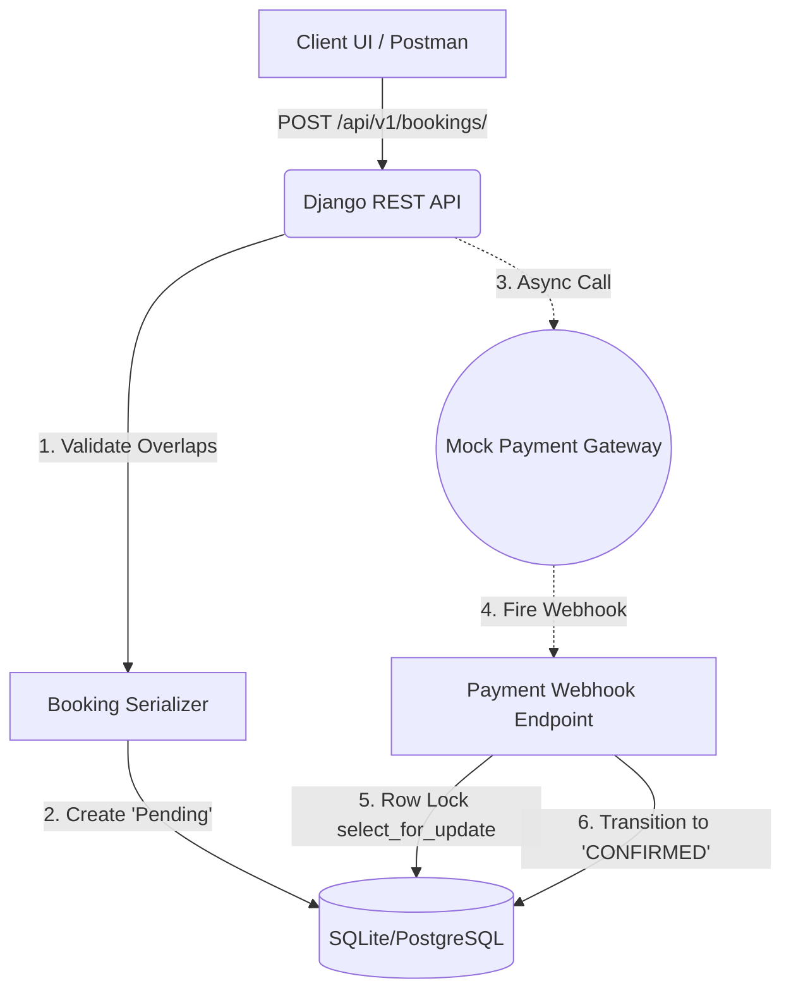

# ⚡ HabotConnect Engine: LSA Service Booking API

**A Production-Ready, Poka-Yoke Django REST Backend Architecture**

[](#)
[](#)
[](#)
[](#)
[](#)
[](#)


---

**HabotConnect Engine** is a highly optimized, modular backend prototype designed to connect parents with Learning Support Assistants (LSAs). Built strictly on the Django MVT architecture, this system was engineered to solve complex database issues (N+1 query problems) and enforce defensive programming via database-level "Poka-Yoke" mistake-proofing.

This repository serves as a blueprint for high-performance, fault-tolerant REST API design.

---

## 🚀 Core Ecosystem Matrix

The platform is designed to guarantee high availability and absolute data integrity across all booking and payment events.

| Module | ⚡ Design Pattern | 🧠 Implementation details |
| :--- | :--- | :--- |
| **Relational Data Schema** | Django ORM (Models) | Highly normalized structure connecting `Parent`, `LSA_Profile`, `Skill`, and `Booking`. Primary keys utilize UUIDs for enhanced security. |
| **Business Logic Validations** | DRF Serializers | Mathematical validation algorithm rejecting requested time slots that overlap with any existing `PENDING` or `CONFIRMED` LSA bookings. |
| **Defensive Architecture** | Database `CheckConstraint` | "Poka-Yoke" logic built directly into the database schema, physically preventing the insertion of bookings where `end_time` occurs before `start_time`. |
| **Idempotent Webhooks** | `APIView` Controllers | Automated listener for mock payment systems. State transitions are wrapped in `transaction.atomic()` with `select_for_update()` row-locking to eliminate race conditions. |

---

## 🏗️ System Architecture & Webhook Workflow

The system utilizes an atomic transaction architecture to guarantee fault tolerance during background payment events.



---

## ⚡ Performance & Reliability Matrix

The platform addresses critical backend performance and reliability challenges using optimized Django ORM queries, database-level constraints, row-level locking, and resilient external service handling.

| Bottleneck                  | Feature                    | Implementation Details                                                                                                                                             |
| :-------------------------- | :------------------------- | :----------------------------------------------------------------------------------------------------------------------------------------------------------------- |
| **The N+1 Query Problem**   | `GET /api/v1/lsas/search/` | Uses Django's `prefetch_related('skills')` to consolidate database queries. Fetching 10,000 LSAs requires exactly 2 database queries instead of 10,001.         |
| **Data Corruption**         | Model Layer                | Uses `models.F()` expressions inside a `CheckConstraint` to enforce chronological time integrity directly at the database level.                                  |
| **Race Conditions**         | Webhook Controller         | Uses database row-level locking to ensure simultaneous webhook requests updating the same booking are processed sequentially and safely.                           |
| **Thread Blocking**         | Mock Integrations          | Uses the `requests` library with strict timeouts and comprehensive `try/except` error handling to prevent external service failures from blocking or crashing threads. |


---

## ⚡ Booking & API Processing Matrix

The platform combines Django REST Framework APIs with optimized database operations, strict data validation, concurrency controls, and resilient external service integrations to provide a reliable LSA booking workflow.

| Feature                    | Category                    | Engine / Technology       | Output / Implementation Description                                                                                                      |
| :------------------------- | :-------------------------- | :------------------------ | :---------------------------------------------------------------------------------------------------------------------------------------- |
| **LSA Search**             | API / Performance           | Django ORM                | Searches and retrieves LSAs efficiently while using `prefetch_related('skills')` to eliminate N+1 database queries.                    |
| **Skill Matching**         | API / Data Processing       | Django ORM                | Matches LSAs based on their associated skills and returns structured results through the REST API.                                       |
| **Booking Validation**     | Data Integrity              | Django Models             | Validates booking data and enforces business rules at the model and database layers.                                                     |
| **Time Integrity**         | Data Integrity              | `F()` + `CheckConstraint` | Ensures booking start and end times remain chronologically valid directly at the database level.                                         |
| **Concurrent Bookings**    | Concurrency Control         | Row-Level Locking         | Uses database row-level locking to prevent race conditions when multiple requests attempt to update the same booking simultaneously.    |
| **Webhook Processing**     | Event Processing             | Django API                | Handles external webhook events safely while maintaining consistent booking state during concurrent updates.                            |
| **External Integrations**  | Reliability                 | Python `requests`         | Uses strict request timeouts and exception handling to prevent slow or unavailable external services from blocking application threads. |
| **REST API**               | Backend / Integration       | Django REST Framework     | Provides structured JSON endpoints for LSA search, booking operations, and integration with external clients.                            |

---

## ⚙️ Installation & Development

To test the LSA Booking system locally:

### **1. Clone the Repository**

```bash
git clone (https://github.com/YOUR_GITHUB_USERNAME/Habot-LSA-Booking-API.git)
cd Habot-LSA-Booking-API
```

### **2. Setup the Virtual Environment**


```bash
# Create the environment
python -m venv venv

# Activate it (Windows)
.\venv\Scripts\activate

# Install dependencies
pip install -r requirements.txt
```

### **3. Build the Database**

```bash
python manage.py makemigrations

python manage.py migrate
```

### **4. Run the Engine & Automated Tests**

```bash
# To run the development server:
python manage.py runserver

# To execute the CI/CD test suite locally:
pytest
```
---

Developed with ❤️ by [Gautam Tiwari]
